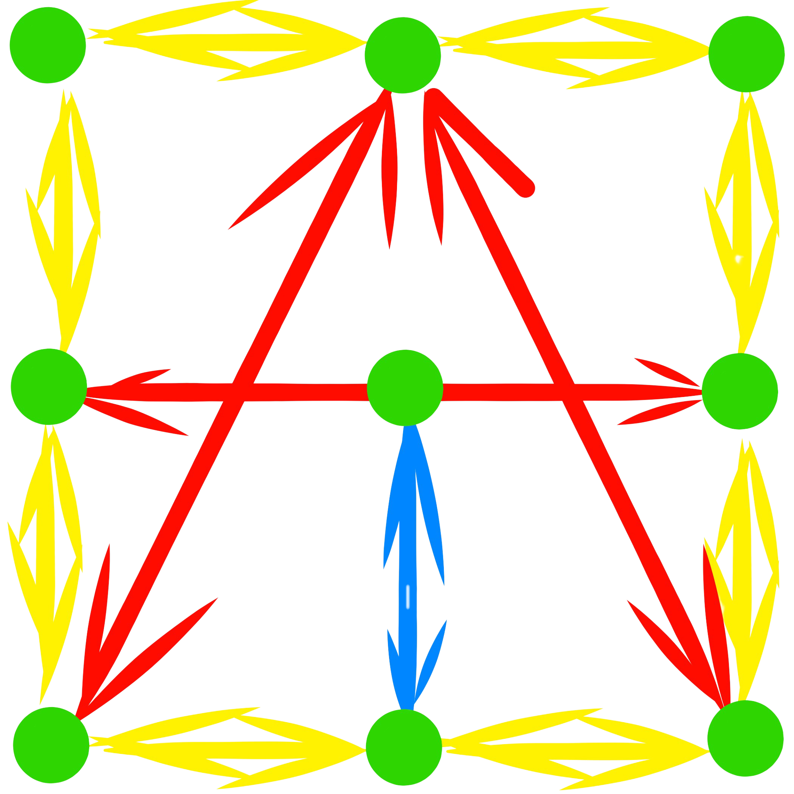

<h1 style="color: #5270d9; font-family: 'PT Sans', sans-serif;">ATORABLE</h1> 
<!-- TOOD: make above to link to atorable.com fix color  -->


<!-- [](https://www.npmjs.com/package/atorable-react) [](https://standardjs.com) -->


<!--  -->
<p align="center">
  
</p>
<!-- <p align="center">
  
© 
</p> -->

# atorable-react

High data costs? Slow PageSpeed? High server load? Need a solution for viral content?
[Atorable.com](https://www.atorable.com/). Serve content better. 

The `atorable-react` package is a [React](https://reactjs.org/) component that processes a [Webtorrent][webtorrent] magnet uri. As more users visit your site the more users serve up your content. More users makes faster downloads, less server load, lower data costs. PageSpeed will also increases by not blocking page load. Using [Webpack][webpack]? Try [atorable-loader][atorable-loader-npm].

#### [Demo][atorable-react]

## Updates / Upgrade to Version 1.1.0 (props)
magnetLink ==> magnetURI
type: string ==> 'video/mp4' or 'video/webm' or 'video/ogg'
WrapATor ==> ATorWrap

Optional: added ability to set loading component
```bash 
loading={<h2 style={{ color: 'orange' }}>Loading</ h2>}
```


## Getting Started

```bash
npm install --save atorable-react
```
## Primary usage w/ [atorable-loader][atorable-loader-npm]
Webpack loader converts files to magnetURI. Below are some example usage with images and video (streaming limited to .mp4)
see advanced usage for more flexibility

```tsx
import React from 'react'
import { ATorVidStrm, ATorImg, ATorVid } from 'atorable-react'

import hugeImage from './hugeImage.jpg' // ==> 'magnet:?xt=urn:...'
import bestMovieEverTribute from './bestMovieEverTribute.mp4' // ==> 'magnet:?xt=urn:...'
const oceanFish = require('./oceanFish.mp4') // ==> {default: 'magnet:?xt=urn:...'}

const Example = (props: any) => {
  return (
    <div>
      <ATorVid width={'320'} height={'240'} type={'video/mp4'} magnetURI={oceanFish} loading={<h2 style={{ color: 'orange' }}>Loading</h2>}/>

      <ATorVidStrm width={'320'} height={'240'} type={'video/mp4'} autoplay={true} magnetURI={bestMovieEverTribute} />

      <ATorImg magnetURI={hugeImage} style={{border: 'solid'}} />
    </div>
  )
}
```

## Magnet URI usage

```tsx
import React from 'react'
import { ATorVidStrm, ATorImg, ATorVid } from 'atorable-react'

let imgPath = 'magnet:?xt=urn:btih:...'
let sintel = 'magnet:?xt=urn:btih:...'
let oceanFish = 'magnet:?xt=urn:btih:...'
let iso = 'magnet:?xt=urn:btih:...'

const Example = (props: any) => {
  return (
    <div>
      <ATorVid width={'320'} height={'240'} type={'video/mp4'} magnetURI={oceanFish} />

      <ATorVidStrm width={'320'} height={'240'} type={'video/mp4'} magnetURI={sintel} />

      <ATorImg magnetURI={imgPath} style={{border: 'solid'}} />

      <ATorDownloader
          magnetURI={iso}
          startDownload={true}        // default false (toggle to true to start download)
          ShowPrgrs={ShowPrgrs}       // example at bottom of readme
          DownloadLink={DownloadLink} // example at bottom of readme
        />
    </div>
  )
}
```

## Advanced usage
Make a component to get wrapped with `<T>` and access props `torrent, dwnldSpeed, downloaded, progress, peers, done`, see [Webtorrent Docs][webtorrent-docs] for more info on dealing with torrent objects.

```tsx
import React, { useEffect, useState Fragment } from 'react'
import { T } from 'atorable-react'
import hugeImage from './hugeImage.jpg';

const WrappedImg = (props: any) => {
  let {torrent, width, height, sizes, style, done} = props,
      [urlState, updateUrl] = useState<string>()

    useEffect(() => {
      let file = torrent.files[0]
      if (file) {
        file.getBlobURL((err, url) => {
            if (err) throw err
            updateUrl(url)
        })
      }
      return () => {}
    }, [done])

  return (
    <Fragment>
      
    </Fragment>
  )
}

const Example = (props: any) => {
  return (
    <div>
      <T magnetURI={hugeImage}>
        <WrappedImg width={'320'} height={'240'} style={{border: 'solid'}} />
      </T>
    </div>
  )
}
```

## Progress Function and Download link
```tsx
export const ShowPrgrs = (props: TorrentUpdates) => {
  let { peers, progress, downloaded } = props

  return (
    <div style={{ clear: 'both' }}>
      <div
        style={{
          width: '100%',
          height: '6px'
        }}
      >
        <div
          style={{
            background: 'limegreen',
            height: '4px',
            width: `${progress * 100}%`
          }}
        ></div>
      </div>
      <div style={{ display: 'flex', justifyContent: 'space-between' }}>
        <div>Downloaded: {downloaded?.toFixed(1)} Mb</div>
        <div>Peers: {peers}</div>
      </div>
    </div>
  )
}

const DownloadLink = (props: {
    url: string | undefined
    filename: string
}) => {
    const { url, filename } = props
    return (
        <a href={url} download>
            Click to download {filename}
        </a>
    )
}
```

## Thank you
[Webtorrent](https://webtorrent.io/)
[create-react-library](https://github.com/transitive-bullshit/create-react-library)
[Material-UI](https://github.com/mui-org/material-ui)


## License
[MIT](./LICENSE) © [Serge Thompson][serge-thompson]

[webtorrent]: https://webtorrent.io/
[webtorrent-docs]: https://webtorrent.io/docs
[webpack]: https://webpack.js.org/

[atorable-react]: https://atorable.github.io/atorable-react/
[atorable-react-source]: https://github.com/Atorable/atorable-react
[atorable-loader-source]: https://github.com/Atorable/atorable-loader
[atorable-loader-npm]: https://www.npmjs.com/package/atorable-loader

[serge-thompson]: https://github.com/sergethompson
[atorable]: https://www.atorable.com/